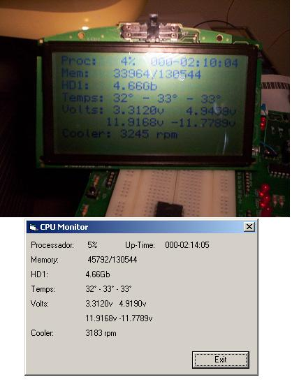



## CPU Monitor with LCD

### Description

CPU monitor with a HG12603 Serial LCD 24x8. require MDM software (link to download inside the zip file).

This program show in a HG12603 LCD (via serial) Processor usage, up-time, memory usage, free disk space, temperatures of processor, voltage, and cooler rpm. The circuit to make this CPU Monitor is in inside the zip file. This program run in a Intel MotherBoard with PIII. Part of code I find in PSC TKS!!!!
 
### More Info
 

             |
---                |---
**Submitted On**   |2004-10-19 22:05:04
**By**             |[Fausto Fiorese Branco](https://github.com/Planet-Source-Code/PSCIndex/blob/master/ByAuthor/fausto-fiorese-branco.md)
**Level**          |Advanced
**User Rating**    |4.4 (22 globes from 5 users)
**Compatibility**  |VB 6\.0
**Category**       |[Miscellaneous](https://github.com/Planet-Source-Code/PSCIndex/blob/master/ByCategory/miscellaneous__1-1.md)
**World**          |[Visual Basic](https://github.com/Planet-Source-Code/PSCIndex/blob/master/ByWorld/visual-basic.md)
**Archive File**   |[CPU\_Monito18079610192004\.zip](https://github.com/Planet-Source-Code/fausto-fiorese-branco-cpu-monitor-with-lcd__1-56833/archive/master.zip)

